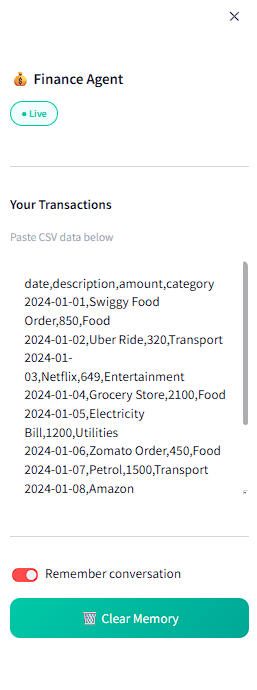
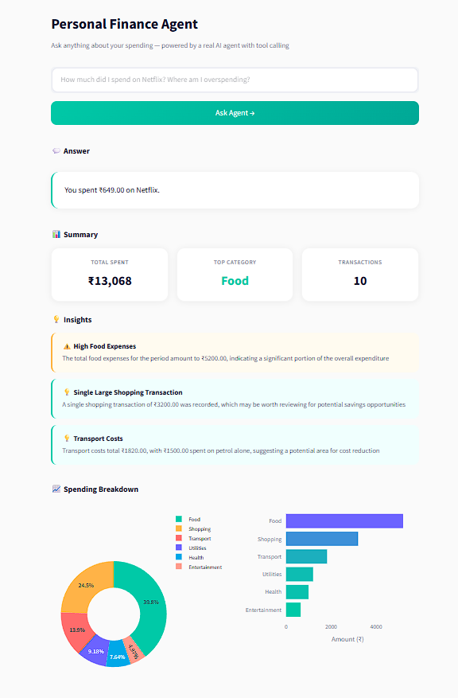

@'
# Finance Agent

I built this because most budgeting tools just show you charts. They don't tell you what to do about them.

This agent analyzes your transactions, answers specific questions about your spending, verifies its own answers using a second LLM critique pass, generates dynamic charts on demand, and remembers what you've already asked — so you don't have to repeat yourself every time.

## Screenshots

## How it works

1. You paste your transactions in CSV format
2. Ask anything — "where am I overspending?" or "show me a chart of my spending"
3. A ReAct agent calls tools to get exact numbers before answering — it never guesses
4. A second LLM (Critique Agent) compares the answer against Pandas ground truth and corrects any errors
5. If the agent detects a chart request, it calls generate_chart and returns a Plotly visualization
6. Repeated questions are served from Redis cache — sub-millisecond on the second call
7. Every question and answer gets saved to SQLite so the next question has context

The memory piece is what makes this feel like a real assistant rather than a one-shot query tool. Ask "how much did I spend on transport?" then ask "compare that to food" — it knows what "that" means.

## What it catches automatically

- Hallucinated amounts — the Critique Agent cross-checks every number against Pandas
- High spending in a single category
- Large one-off purchases that distort the monthly picture
- Categories creeping up compared to others

## Stack

- FastAPI + Uvicorn — backend API
- Streamlit + Plotly — frontend with agent-generated dynamic charts
- Groq (Llama 3.3 70B) — ReAct agent, insight generation, LLM-as-a-Judge critique
- Pandas — transaction parsing, category aggregation, ground truth verification
- Redis — query cache with in-memory fallback when Redis isn't running
- SQLite — conversation memory, no external DB needed
- LangSmith — full request tracing and ReAct loop observability
- Plaid API — OAuth link token flow and webhook handler (sandbox-ready)
- Pydantic v2 — request and response validation
- pytest — 7 tests, all external calls mocked

## Project structure

app/
  core/
    config.py              # env config, validated at startup
    prompts.py             # all prompts as constants
  memory/
    memory_store.py        # SQLite read/write, formats context for prompts
  models/
    schemas.py             # Transaction, FinanceRequest, FinanceResponse
  routers/
    finance.py             # POST /finance, cache/memory/plaid endpoints
  services/
    transaction_service.py # parsing, formatting, summary stats
    insight_service.py     # proactive insight generation
    agent_service.py       # ReAct loop, tool execution, cache, tracing
    verification_service.py # LLM-as-a-Judge critique agent
    cache_service.py       # Redis + in-memory fallback
    plaid_service.py       # OAuth flow, token exchange, webhook handler
frontend/
  streamlit_app.py         # UI with dynamic charts, cache indicator, badges
tests/
  test_finance.py          # 7 tests, no API key needed

## Run locally

git clone https://github.com/saithrishadaggupati/finance-agent
cd finance-agent
python -m venv .venv
.venv\Scripts\activate
pip install -r requirements.txt
cp .env.example .env
# add GROQ_API_KEY and optionally PLAID_CLIENT_ID, PLAID_SECRET
uvicorn app.main:app --reload --port 8001
streamlit run frontend/streamlit_app.py

## API endpoints

- POST /api/v1/finance — main agent endpoint
- DELETE /api/v1/finance/memory — clear conversation memory
- GET /api/v1/finance/memory — view recent memory
- DELETE /api/v1/finance/cache — flush cache
- GET /api/v1/finance/cache/status — check Redis connection
- GET /api/v1/plaid/link-token — start Plaid OAuth flow
- POST /api/v1/plaid/exchange-token — exchange public token
- POST /api/v1/plaid/sync — sync transactions
- POST /api/v1/plaid/webhook — handle Plaid webhooks

## Tests

pytest tests/ -v
# 7 passed — all external calls are mocked
'@ | Set-Content "C:\Users\ASUS\finance_agent\README.md" -Encoding UTF8; git add .; git commit -m "docs: update README to reflect all upgrades"; git push